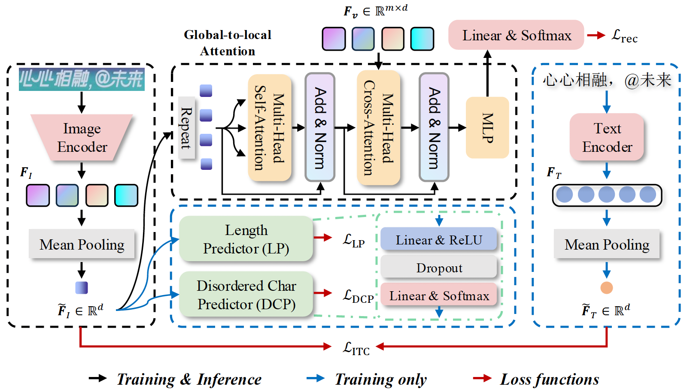

<div align='center'>

# Summarize before Glimpse: Brain-inspired Non-autoregressive Scene Text Recognizer

</div>

The official code of NASTR (Under Review).

<!-- ### News
- **YY-MM-DD**:  -->

## Abstract

The language modeling paradigm for scene text recognition (STR) has demonstrated impressive universal capabilities across extensive STR scenarios. 
However, existing methods still encounter challenges in effectively handling text images with irregular shapes and diverse appearances (e.g., curve, artistic, multi-oriented) due to the absence of contextual information during initial decoding. 
In this work, inspired by the principle of ‘forest before trees’ in human visual perception, 
we introduce NASTR, a non-autoregressive scene text recognizer capable of endowing global-aware for the attentional decoder. 
Specifically, we design a global-to-local attention procedure, simulating the mechanism of globally holistic visual signal processing preceding locally detailed response in the human brain visual system. 
This is achieved by leveraging the global image information queries to condition the generation of glimpse vectors at each decoding time step. 
This procedure empowers the NASTR model to achieve on-par performance with its state-of-the-art autoregressive counterparts while executing fully parallel. 
Moreover, we propose multiple optional and flexible encoding constraint components to alleviate the representation quality degradation issue caused by the global image information queries in handling STR takes with multilingual and multi-domains. 
These components constrain the global image features from the perspective of global structural, global semantic, and linguistic knowledge. 
Extensive experimental results demonstrate that NASTR consistently outperforms existing methods on both Chinese and English STR benchmarks.

<div align="center">
  
</div>

## Getting Started

### 1. Datasets

The adopted datasets can be downloaded from the following links:

- [Union14M](https://github.com/Mountchicken/Union14M), Revisiting Scene Text Recognition: A Data Perspective
- [Scene and Web](https://github.com/FudanVI/benchmarking-chinese-text-recognition), Benchmarking Chinese Text Recognition: Datasets, Baselines, and an Empirical Study 

### 2. Runtime Environment

 

 For Chinese datasets, `python==3.11`, `pytorch==2.3.1`, `torchvision==0.18.1` are recommended.

### 2.1 Installation

First, clone the repository locally:

```
git clone https://github.com/ML-HDU/NASTR.git
```

Then, install PyTorch 1.11.0+, torchvision 0.12.0+, and other requirements:
```
conda create -n nastr python=3.8
conda activate nastr
conda install pytorch==1.11.0 torchvision==0.12.0 -c pytorch
pip install -r requirements.txt
```

### 2.2 Pretrained Models and corresponding training log

- **Union14M Dataset**: Average accuracy on Union14M-Benchmark (Curve, Multi-oriented, Artistic, Contextless, Salient, Multi-Words, and General)

| Model                                  | Average Acc   | Pre-trained weights | Training log | Testing log |
|--------------------------------------- | ------------- | ------------------- | ------------ | ----------- |
| $\mathtt{NASTR}_{\mathtt{SVTR-B}}$     | 76.05         | [Google Drive](https://drive.google.com/file/d/17W3dRSOWihzD3e4FkkSnrizaJU2qMbHw/view?usp=drive_link)    | [log](logs/Union14M/NASTR_svtr_base/train_log_NASTR_svtr_base_English_Union14M.log)           | [log](logs/Union14M/NASTR_svtr_base)     |    
| $\mathtt{NASTR}_{\mathtt{ViT}}$        | 78.21         | [Google Drive](https://drive.google.com/file/d/1kgeRcoVCwZirnKOq2vgP673f0zS-tdaG/view?usp=drive_link)    | [log](logs/Union14M/NASTR_vit/train_log_NASTR_vit_English_Union14M.log)                       | [log](logs/Union14M/NASTR_vit)     |
| $\mathtt{NASTR}_{\mathtt{ViT}}^{\dag}$ | 79.26         | [Google Drive](https://drive.google.com/file/d/1qR5wXMcmNATXRTc23jkoAR9Bm58KgGS8/view?usp=drive_link)    | [log](logs/Union14M/NASTR_vit_pretrained/train_log_NASTR_pretrained_vit_English_Union14M.log) | [log](logs/Union14M/NASTR_vit_pretrained)     |

- **Chinese Datasets**

| Model                                  | Scene | Pre-trained weights | Training log | Testing log |
|--------------------------------------- | ----- | ------------------- | ------------ | ----------- |
| $\mathtt{NASTR}_{\mathtt{SVTR-B}}$     | 78.50 | [Google Drive](https://drive.google.com/file/d/1HRssG7MevVWTPwatM1b0zB5_7-0ySVhc/view?usp=drive_link)    | [log](logs/BCTR_Scene/NASTR_svtr_base/train_log_NASTR_svtr_base_Chinese_scene.log)      | [log](logs/BCTR_Scene/NASTR_svtr_base/test_log_NASTR_svtr_base_Chinese_scene.log)     |    
| $\mathtt{NASTR}_{\mathtt{ViT}}$        | 77.34 | [Google Drive](https://drive.google.com/file/d/1Vk_TTEqoMd83Kjx46R7W_b0Wz6XCAjVb/view?usp=drive_link)    | [log](logs/BCTR_Scene/NASTR_vit/train_log_NASTR__vit_Chinese_scene.log)      | [log](logs/BCTR_Scene/NASTR_vit/test_log_NASTR_vit_Chinese_scene.log)     |    
|                                        |       |                     |              |             |
| Model                                  | Web   | Pre-trained weights | Training log | Testing log |
| $\mathtt{NASTR}_{\mathtt{SVTR-B}}$     | 70.72 | [Google Drive]()    | [log]()      | [log]()     |    
| $\mathtt{NASTR}_{\mathtt{ViT}}$        | 72.10 | [Google Drive]()    | [log]()      | [log]()     |    


### 2.3 Model Training (Single GPU)

- Modify ``` train_dataset ``` and ``` val_dataset ``` args in ``` config.json ``` file, including ``` alphabet ```, ``` save_dir ```.
- Modify ``` keys.txt ``` in ``` util_files/keys.txt ``` file if needed according to the vocabulary of your dataset.

#### Chinese scene text recognition
```
python train_STR.py -c configs/config_lmdb_scene.json
```
or

```
python train_STR.py -c configs/config_lmdb_web.json
```

#### English scene text recognition
```
python train_STR_en.py -c configs/config_English.json
```

### 2.4 Model Testing

- Modify ``` checkpoint_path ``` and ``` test_dataset ``` args in ``` config.json ``` file, including ``` alphabet ```, ``` save_dir ```.
- Modify ``` model_arch ``` to match the model architecture in the pretrained weights. E.g., $\mathtt{NASTR}_{\mathtt{ViT}}$, ``` model_arch ➡️ encoder_kwargs ➡️ type: "vit" ```

#### Chinese scene text recognition
```
python test_STR.py -c configs/config_lmdb_TEST.json
```

#### English scene text recognition
```
python test_STR_en.py -c configs/config_lmdb_TEST_English.json
```

### 2.5 Recognition Examples

<div align="center">
  
</div>

## Customization

#### Checkpoints

You can specify the name of the training session in ``` config.json ``` files:

```
"name": "NASTR"
"run_id": "example"
```
The checkpoints with best performance at training stage will be saved in ``` save_dir/models/name/run_id_timestamp/model_best.pth ```, with timestamp in mmdd_HHMMSS format.


## License

This project is licensed under the MIT License. See LICENSE for more details.

## Acknowledgements

- [MASTER](https://github.com/wenwenyu/MASTER-pytorch)
- [ABINet](https://github.com/FangShancheng/ABINet)
- [MAERec](https://github.com/Mountchicken/Union14M)
- [BCTR](https://github.com/FudanVI/benchmarking-chinese-text-recognition)